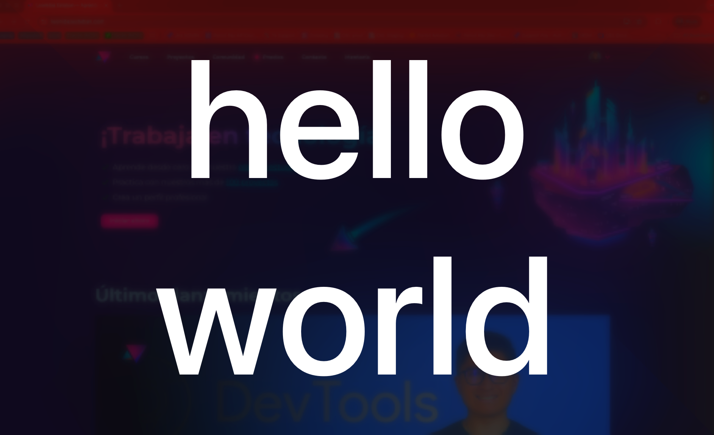

# Large Type for Raycast

Display whatever you type in Raycast as huge text on a Liquid Glass overlay — like Alfred's `⌘L` but native to macOS 26 Tahoe.



---

## What it does

You type something in Raycast (a phone number, address, code, anything), pick *Show Large Type* from the fallback section, and your text appears centered on a fullscreen Liquid Glass panel. Click anywhere or press `Esc` / `Return` / `Space` to dismiss.

## Setup

1. `npm install`
2. `npm run dev` — this compiles the Swift helper and the icon, then starts Raycast in dev mode
3. In Raycast → **Settings → Extensions → Large Type → Show Large Type**, mark it as a **Fallback Command**
4. (Optional) **Settings → Manage Fallback Commands**, drag *Show Large Type* to the top of the list so it's invoked by default

## Usage

```
⌘Space  →  type "hola"  →  ↓ to fallback section  →  Enter on Show Large Type
```

If *Show Large Type* is the first fallback, you can usually just press `⌘↵` from the search bar with text typed.

## How it works

The extension is a thin Raycast `no-view` command that delegates the actual rendering to a compiled Swift binary. Architecture:

```
Raycast search bar text
       │
       ▼
[ src/show.ts ]   ←  receives props.fallbackText
       │
       │ spawn(detached, unref)
       ▼
[ assets/LargeType ]   ←  Swift / AppKit binary
       │
       ▼
  Borderless NSWindow  +  NSGlassEffectView (Liquid Glass)
```

### `src/show.ts` (TypeScript, runs in Raycast)

- Mode: `no-view`, no arguments
- Reads `props.fallbackText` (populated by Raycast only when launched via the *Fallback Commands* UI — not via global hotkey)
- Spawns the Swift helper detached so the Node process can exit immediately
- Logs every invocation to `/tmp/raycast-large-type.log` for debugging

### `swift/LargeType.swift` (compiled to `assets/LargeType`)

- **Window**: borderless `NSWindow` at `.screenSaver` level, transparent, joins all spaces, full-screen aux
- **Background**: `NSGlassEffectView` on macOS 26+ with a 35% black tint (Liquid Glass), falls back to `NSVisualEffectView` (`.hudWindow` material, `behindWindow` blending) on older macOS
- **Text fitting**: binary search on font size from `screenHeight` down to `16pt`, finding the largest size where the text fits inside `screen − padding` on both axes (with word wrapping). This way `"hi"` fills almost the whole screen and `"a longer paragraph"` shrinks to fit.
- **Padding**: ~8% horizontal, ~6% vertical (proportional to screen, with sane minimums for tiny screens)
- **Layout fix**: `NSTextField.preferredMaxLayoutWidth` + an explicit `widthAnchor` constraint pin the label to the available width — without this, AppKit uses the unwrapped intrinsic width and long text overflows the screen
- **Dismiss**: handles `mouseDown` and `keyDown` (Esc / Return / Space) — calls `NSApp.terminate`

### `swift/GenerateIcon.swift`

Tiny standalone Swift script that renders a 512×512 "Aa" on a dark gradient and writes it to `assets/extension-icon.png`. Runs as part of `predev` / `prebuild`.

## Scripts

| Script | What |
|---|---|
| `npm run dev` | Compile Swift → start Raycast dev mode |
| `npm run build` | Compile Swift → build extension for publishing |
| `npm run build:helper` | Recompile only the Swift overlay binary |
| `npm run build:icon` | Regenerate the extension icon |
| `npm run lint` / `fix-lint` | Raycast lint |

## Project layout

```
.
├── src/
│   └── show.ts              # Raycast command (TypeScript)
├── swift/
│   ├── LargeType.swift      # Overlay window helper (AppKit, Liquid Glass)
│   └── GenerateIcon.swift   # Icon renderer
├── assets/                  # Generated — gitignored
│   ├── LargeType            # Compiled Swift binary
│   └── extension-icon.png   # Generated icon
├── metadata/
│   └── preview.png
├── package.json
└── tsconfig.json
```

## Requirements

- macOS 26 Tahoe (for native Liquid Glass) — older macOS uses a blur fallback
- Node 20+
- Swift toolchain (`swiftc`, ships with Xcode Command Line Tools)
- Raycast 1.83+

## Notes / caveats

- `props.fallbackText` is only populated when the command is launched from the **Fallback Commands UI** (not via global hotkey). This is a Raycast API limitation — see the JSDoc on `LaunchProps.fallbackText` in `@raycast/api`. The closest replication of Alfred's `⌘L` flow is therefore: type in search → `⌘↵` (or arrow → enter) on the first fallback.
- Currently uses `NSScreen.main` only — multi-monitor setups will always show on the main display.
